# Как перенести свою игру в Telegram?
Данный репозиторий содержит в себе подробный гайд по переносу своей игры в Telegram на примере GitHub Pages, для более удобного теста создается базовая структура сайта для GHPages (может использоваться не только там). Если пользователь хочет развернуть игру у себя на компьютере/сервере, необходимо иметь белый ip, для этого будет отдельный гайд.
В этом мануале реализован пример игры на Godot с помощью нашего инструмента и встроенного в Godot функционала.
## 1. Экспорт игры в HTML5 код
В разных движках есть для этого различные инструменты, в Godot уже реализована разработчиками функция (пока не реализована в Godot Mono (для .NET) >4).
1. Заходим в наш проект в Godot 
2. Заходим во вкладку Project > Export 
3. Add... > Web 
4. Если появляется ошибка, как здесь:
5. Нажимаем "Manage Export Templates":
6. Открывается менеджер темплейтов для веба, нажимаем сразу "Download and Install" (примерно 1 ГБ) 
7. Нажимаем Close, возвращаемся в Project > Export и заходим в файловый менеджер  
8. Создаем папку под HTML5 код, файлу даем имя index.html! (это обязательно):   

9. Save > Export Project... > Save 
10. Проверяем, что код был экспортирован: 
11.  Также можно проверить, что код корректно запускается в браузере.
-  Устанавливаем Python (в терминале): 
	- На Windows: 
		```winget install python.python.3.13```
	- На Linux Debian/Ubuntu: 
		```sudo apt-get install python```
	- На Linux Fedora/Red Hat: 
		```sudo dnf install python```
	- На Linux Arch: 
		```sudo pacman -S python```
-  Заходим в папку с кодом HTML5 в терминале, и прописываем:
  	```python3 -m http.server```
-  В браузере в адресную строку вбиваем ```localhost:8000```
-  Проверяем работоспособность сервера:
Теперь можно создавать репозиторий Github Pages.
## 2. Разворачиваем сервер с помощью Github Pages
12. Заходим в папку с вашим HTML5 кодом
13. Скачиваем скрипт под вашу систему (Linux/Windows) с официальной страницы релизов: https://github.com/dens1neBS/telegamesapi/releases и запускаем.
```bash
# Linux
curl -O https://github.com/dens1neBS/telegamesapi/releases/download/v0.1.2/upload_game.sh 
chmod +x upload_game.sh
./upload_game.sh

# Windows
curl -O https://github.com/dens1neBS/telegamesapi/releases/download/v0.1.2/upload_game.bat 
./upload_game.bat
```
1. Выполняем инструкции, что авторизоваться в GitHub. 
	 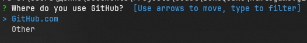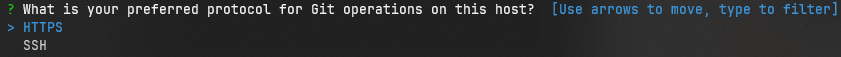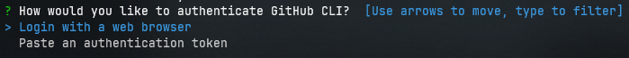
	Затем появившийся код вводим в окно браузера (откроется автоматически, если нажать Enter) 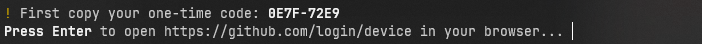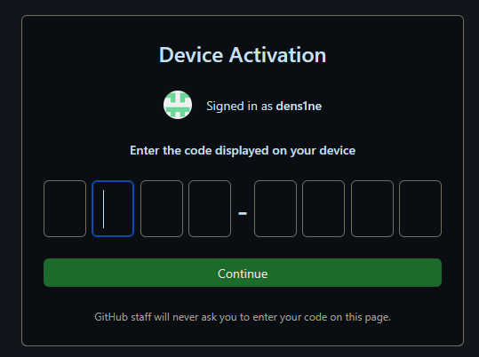
	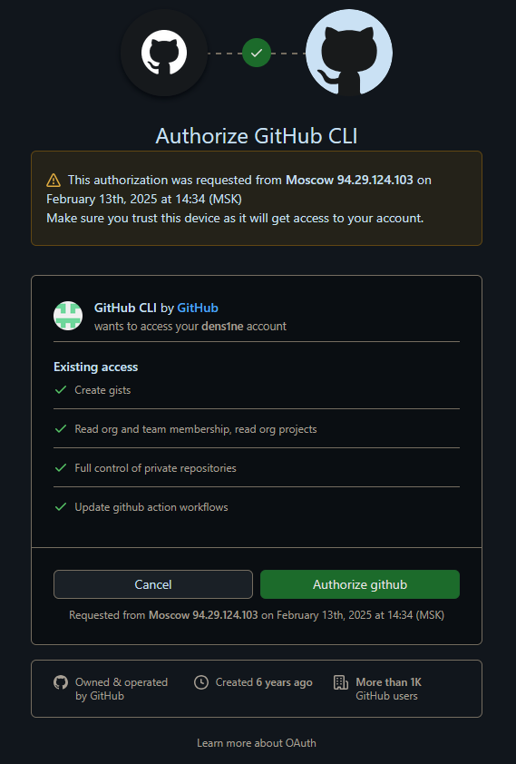

2. Выбираем "Push an exisiting repository to GitHub", затем нажимаем Enter до следующего пункта
	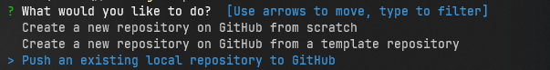
3. Когда будет запрашиваться название проекта ОБЯЗАТЕЛЬНО заполняем его по форме <ваш юзернейм в гитхабе>.github.io, иначе GitHub pages работать на вашем репозитории НЕ БУДЕТ!
	 
4. В области видимости выбираем "Public"
	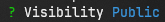
5. Заходим на ваш репозиторий, чтобы проверить код: https://github.com/<ваш юзернейм>.github.io и сам сайт <ваш юзернейм>.github.io
6. Теперь заходим в телеграм в диалог с [@BotFather](https://t.me/BotFather)
	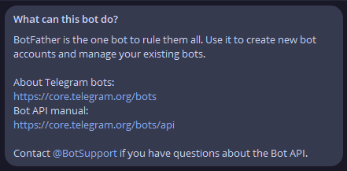
7. Регистрируемся (если не были до данного момента) и вводим комманду /newbot
8. Создаем бота по инструкции
9. Затем вводим команду /newapp
10. Заполняем поля примерно вот так:
	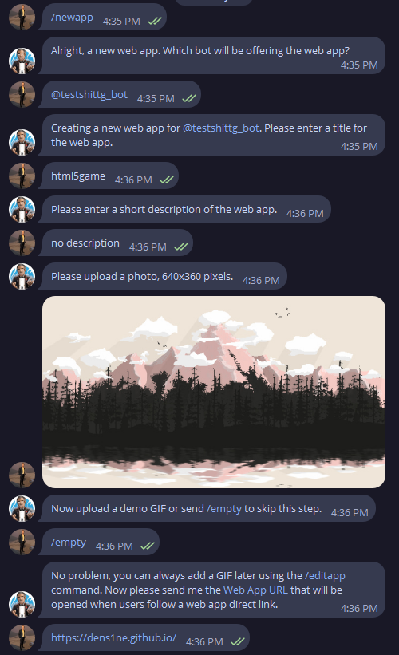
11. Вводим уникальный никнейм для приложения, и @BotFather выдает нам ссылку на игру!
	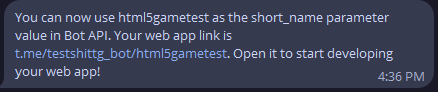
12. Теперь у вас есть ссылка на вашу игру в рамках Telegram. Как её загрузить в вашего бота - смотрите в нашей документации к telegamesapi (https://github.com/dens1neBS/telegamesapi/wiki)

## 3. Cвязь с игрой с помощью telegamesapi
По началу может показаться, что в обратной связи нет смысла. Но если вам требуется реализовать удаленную связь с запущенной игрой, наш заготовленный код может вам помочь. В случаях когда нужно, например, получать информацию об активных игроках, продоставлен туториал для получения этих апдейтов с помощью telegamesapi в [официальном репозитории](https://github.com/dens1neBS/telegamesapi).
## 4. Пример реализации
В качестве примера реализована игра в [Telegram](https://t.me/testshittg_bot/html5gametest) и есть возможность посмотреть [исходный код](https://github.com/dens1ne/dens1ne.github.io) проекта.
