# Как перенести свою игру в Telegram?
Данный репозиторий содержит в себе подробный гайд по переносу своей игры в Telegram на примере GitHub Pages, для более удобного теста создается базовая структура сайта для GHPages (может использоваться не только там). Если пользователь хочет развернуть игру у себя на компьютере/сервере, необходимо иметь белый ip, для этого будет отдельный гайд.
В этом мануале реализован пример игры на Godot с помощью нашего инструмента и встроенного в Godot функционала.
## 1. Экспорт игры в HTML5 код
В разных движках есть для этого различные инструменты, в Godot уже реализована разработчиками функция (пока не реализована в Godot Mono (для .NET) >4).
1. Заходим в наш проект в Godot 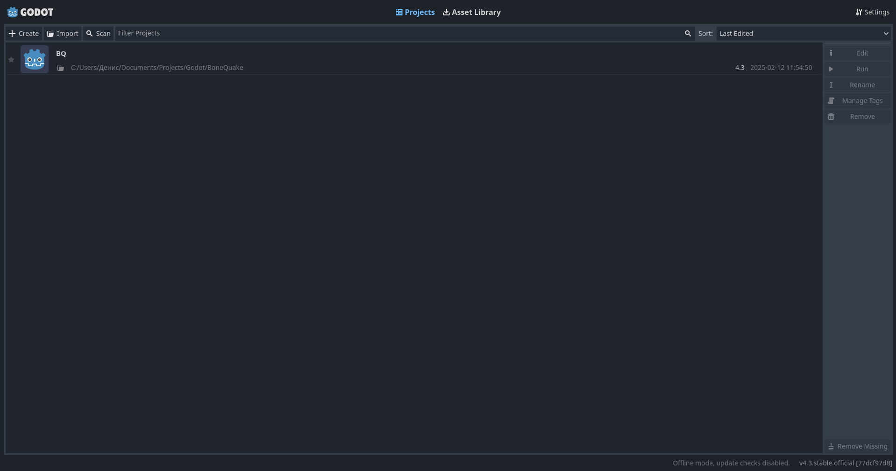
2. Заходим во вкладку Project > Export 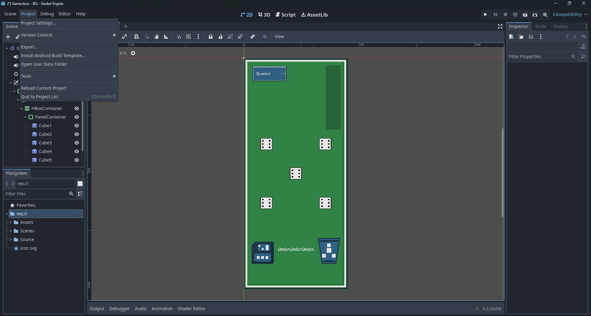
3. Add... > Web 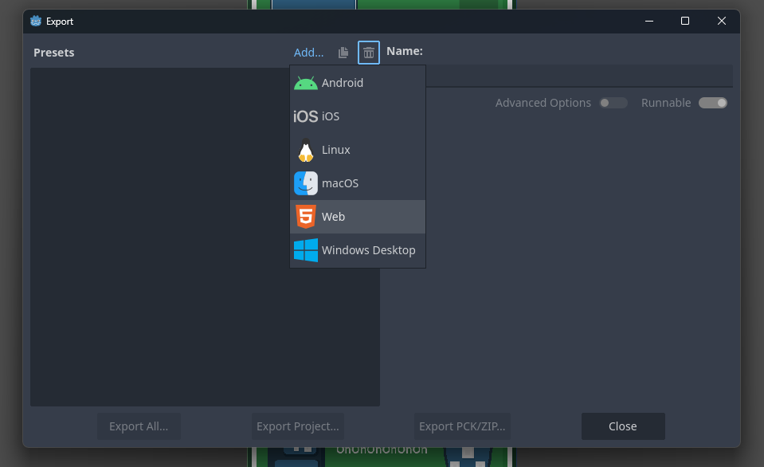
4. Если появляется ошибка, как здесь: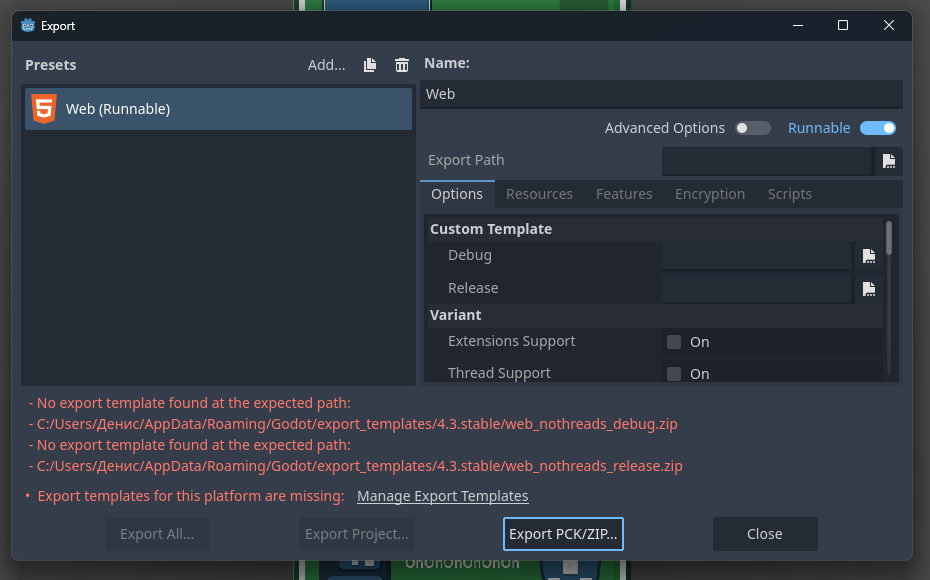
5. Нажимаем "Manage Export Templates":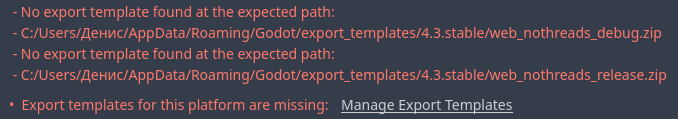
6. Открывается менеджер темплейтов для веба, нажимаем сразу "Download and Install" (примерно 1 ГБ) 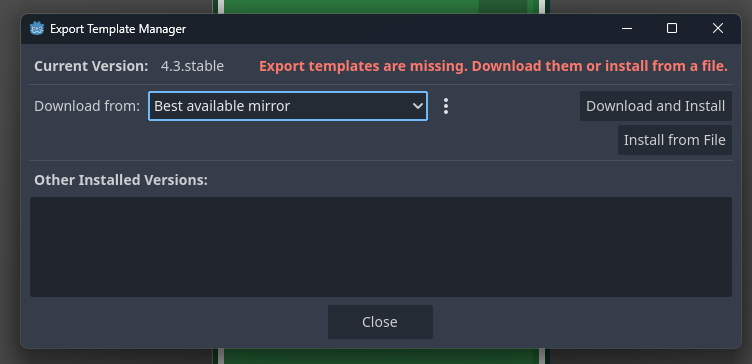
7. Нажимаем Close, возвращаемся в Project > Export и заходим в файловый менеджер  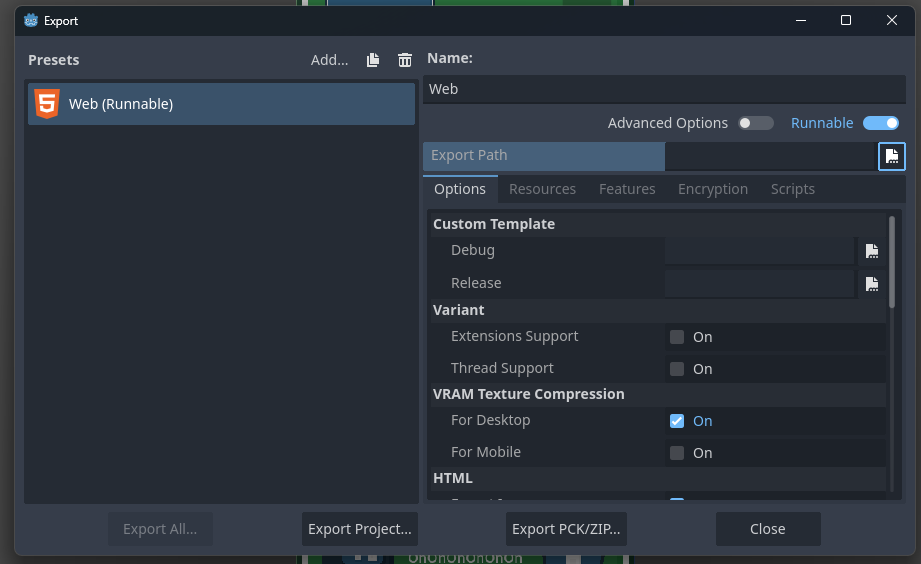
8. Создаем папку под HTML5 код, файлу даем имя index.html! (это обязательно): 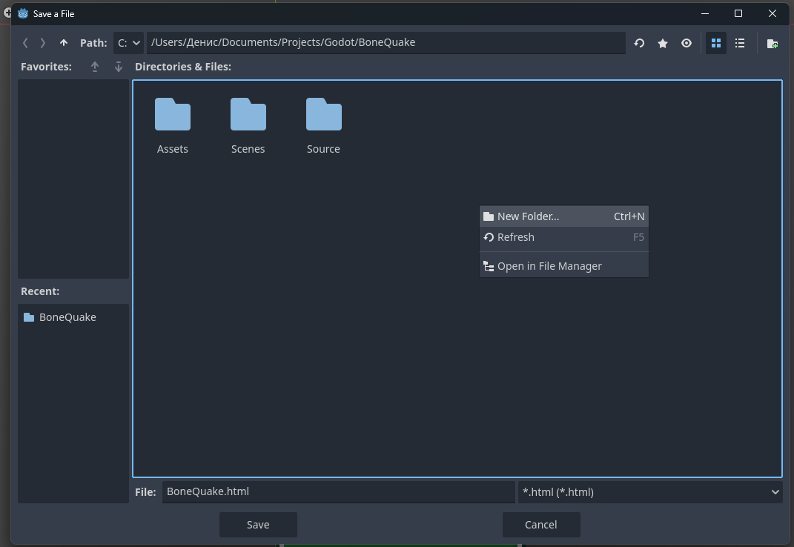 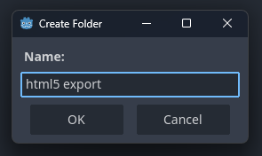 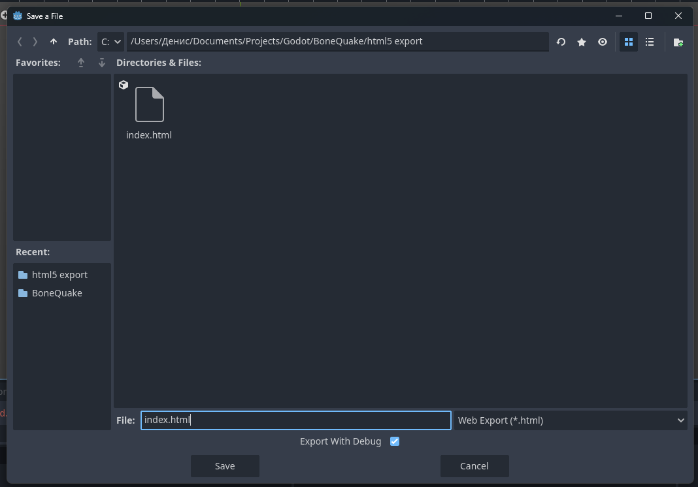

9. Save > Export Project... > Save 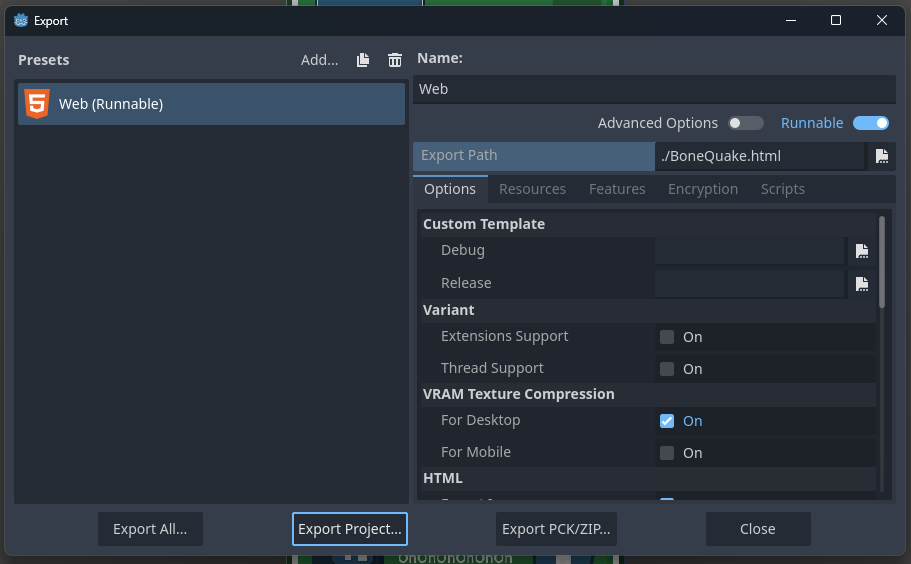
10. Проверяем, что код был экспортирован: 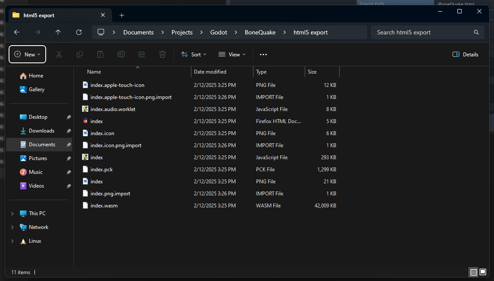
11.  Также можно проверить, что код корректно запускается в браузере.
	-  Устанавливаем Python: 
		- На Windows: 
			```winget install python.python.3.13```
		- На Linux Debian/Ubuntu: 
			```sudo apt-get install python```
		- На Linux Fedora/Red Hat: 
			```sudo dnf install python```
		- На Linux Arch: 
			```sudo pacman -S python```
	-  Заходим в папку с кодом HTML5 в терминале, и прописываем:
		```python3 -m http.server```
	-  В браузере в адресную строку вбиваем ```loclhost:8000```
	-  Проверяем работоспособность сервера: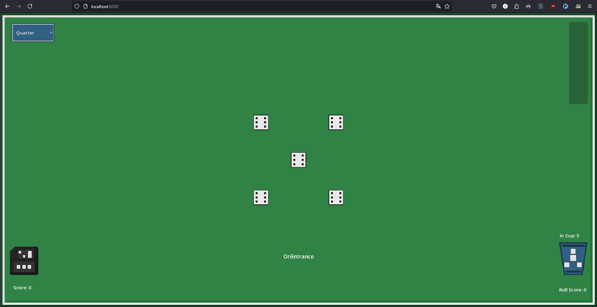
Теперь можно создавать репозиторий Github Pages.
## 2. Разворачиваем сервер с помощью Github Pages
